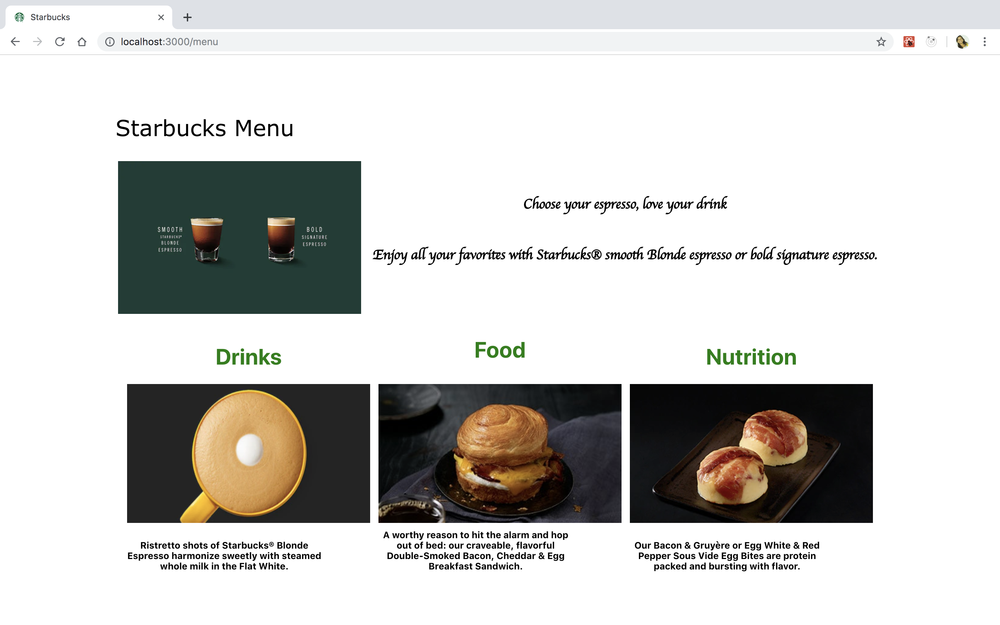
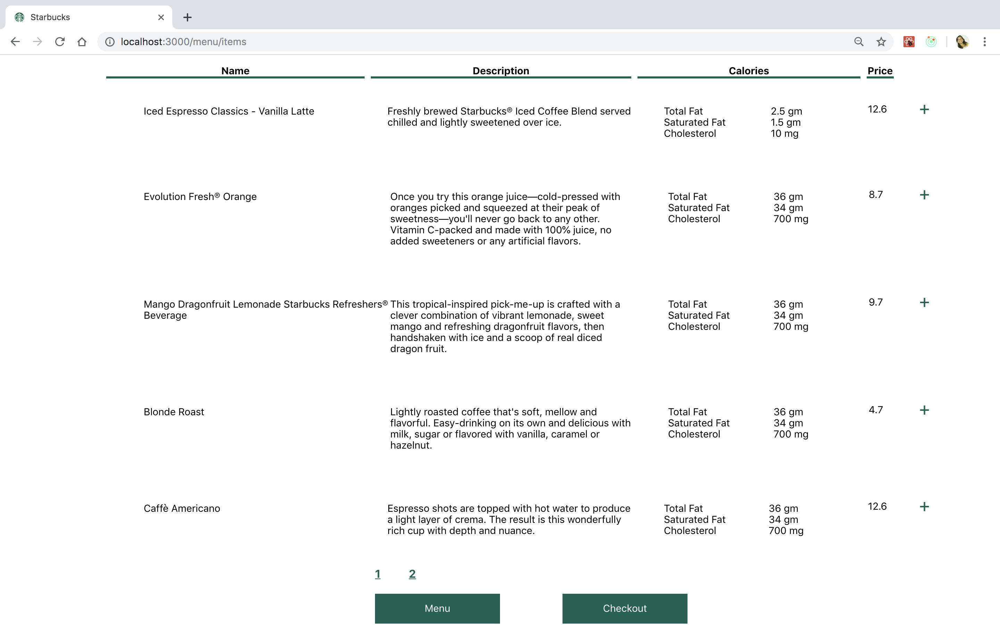
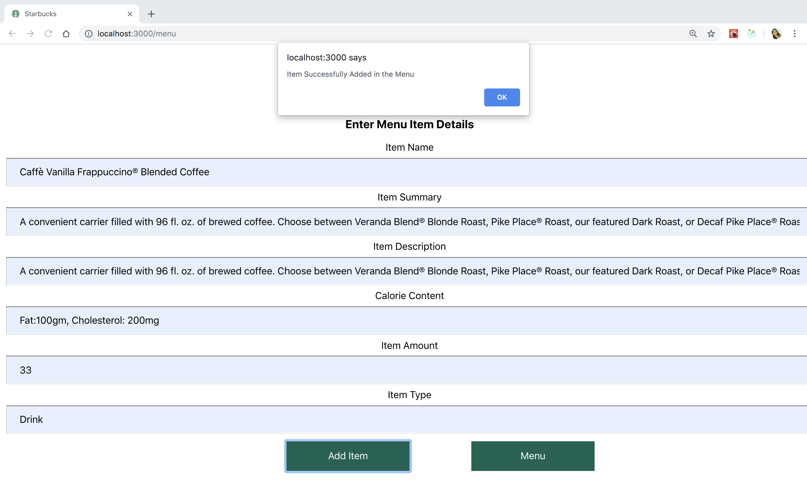

# sp19-281-vs3
Purpose : Building an online coffee Web Application using *All Technologies used*

          
# Users Module Architecture

# Menu Module Architecture

# Payments Module Architecture

##### Menu HomePage:

##### Item Detail Page:

##### Admin Add Item Page:

