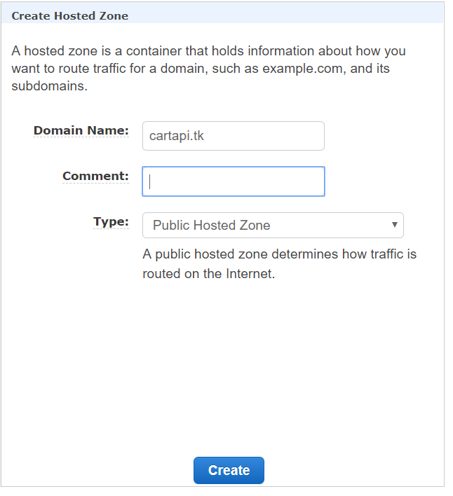
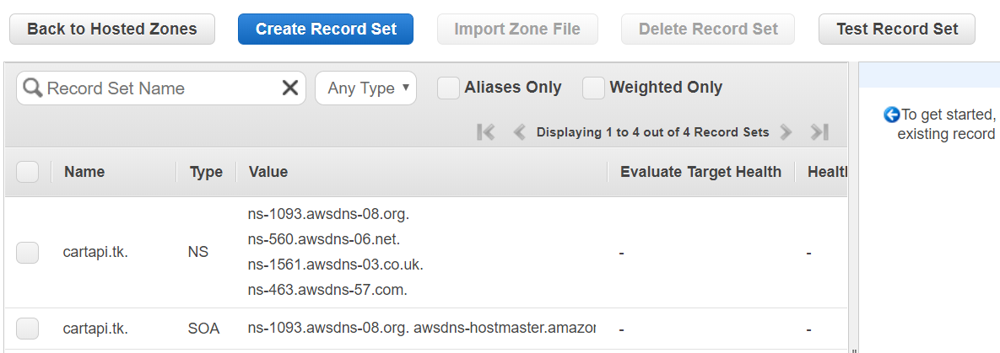
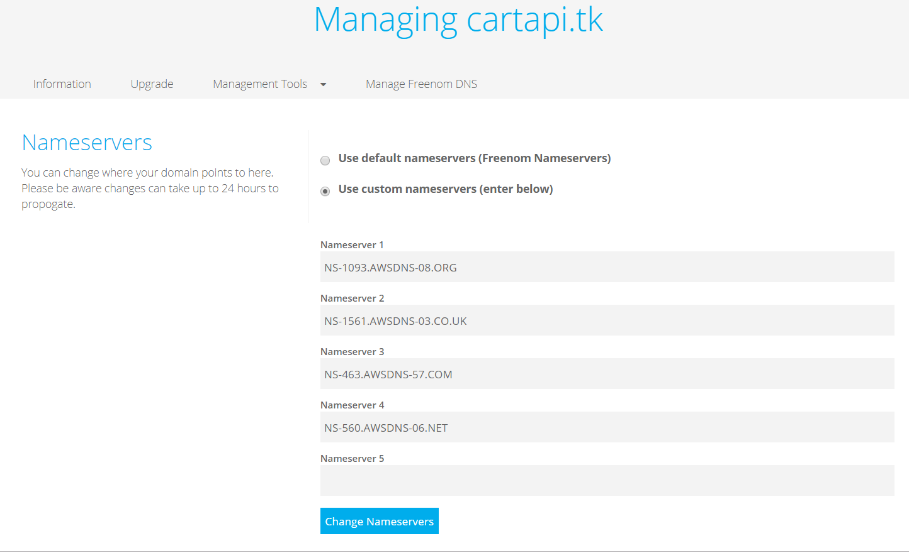

# AWS Route 53 CART API Walk-through

## Create Hosted Zone

- Open the Amazon Route 53 console using link − https://console.aws.amazon.com/route53/

- Click create hosted zone option on the top left corner of the navigation bar.

- Enter your domain name registered with any domain name registrar and a comment for the hosted zone. Click create zone after filling in the details

- Hosted zone for your domain will be created and you will be given four DNS endpoints called delegation set. These endpoints should to be updated in your domain names nameserver section. In my case, it is freenom.com. Go to your domain’s control panel and update the route53 DNS endpoints , deleting all the default values if any. The update will take a while to propagate.

