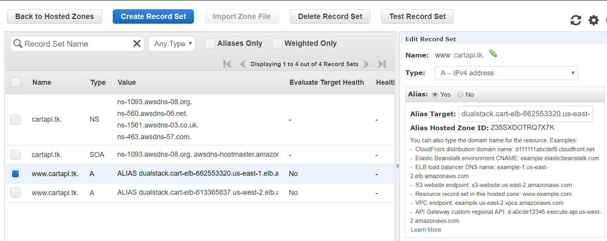
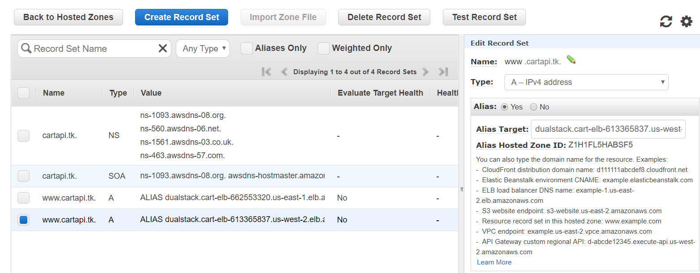

# AWS Route 53 CART API Walk-through

## Create Hosted Zone

- Open the Amazon Route 53 console using link − https://console.aws.amazon.com/route53/

- Click create hosted zone option on the top left corner of the navigation bar.

- Enter your domain name registered with any domain name registrar and a comment for the hosted zone. Click create zone after filling in the details


- Hosted zone for your domain will be created and you will be given four DNS endpoints called delegation set. These endpoints should to be updated in your domain names nameserver section. In my case, it is freenom.com. Go to your domain’s control panel and update the route53 DNS endpoints , deleting all the default values if any. The update will take a while to propagate.


## Route DNS Traffic for Your Domain to Your Load Balancers

 I have two public load balancers in two different aws regions. So I have to create seperate A records for different regions.

- Click create record set option , fill in the following details and create record set option.

```
name : append www
Type : A
Alias : 
YES - If you want to point the domain name to any load balancers, s3 or cloud front enpoints.
NO -  if you want to point the domain name to the servers ip.

In my case, i'm selecting no because am pointing the domian name directly to the servers ip address.

Value : address of your Load Address which is hosting your application
Routing Policy : latency 
There are four routing policies: simple , latency, weighted and failover.

Region : region where you have the instance.
Set ID : description for the record (eg : oregon data center)
```




